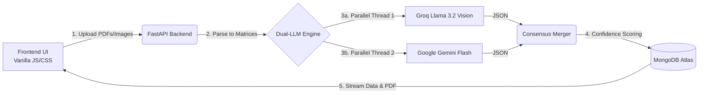

# Firstsource PoC Presentation (5 Slides)
*Copy and paste the text below into your PowerPoint slides.*

---

## Slide 1: PROBLEM UNDERSTANDING AND OBJECTIVE
**Title**: Firstsource PoC: Clinical Document Intelligence Hub
**Objective**: Build a Proof-of-Concept that intelligently extracts, structures, and audits unstructured clinical documents.

**The Problem**:
- Healthcare staff spend countless hours manually extracting data from fragmented documents (lab reports, handwritten notes, intake forms).
- This manual process is slow, expensive, and highly prone to human error, leading to billing mistakes and delayed patient care.

---

## Slide 2: SOLUTION ARCHITECTURE AND DESIGN FLOW
**Title**: System Architecture & Data Flow

**Architecture Diagram**:
*(Copy this code block into [Mermaid Live](https://mermaid.live/) to instantly generate your diagram image for the slide!)*

**Workflow**:
1. **Ingestion**: Users upload fragmented files (PDFs, JPGs, TXTs) via the frontend UI.
2. **Processing**: FastAPI backend parses documents into image matrices.
3. **AI Extraction**: Dual-LLM Ensemble (Google Gemini & Groq Llama Vision) process data in parallel threads.
4. **Data Storage**: Extracted JSON records and raw PDF binaries are securely stored in MongoDB GridFS.
5. **Visualization**: A split-screen dashboard renders the native document alongside the AI insights.

---

## Slide 3: IMPLEMENTATION HIGHLIGHTS
**Title**: Technical Decisions & Implementation Highlights

**Key Highlights**:
- **Single-Pass Prompting**: We collapsed the multi-pass LLM extraction into a single, highly efficient extraction & scoring prompt to cut latency by 50%.
- **Dynamic Ensemble Merging**: Both LLM outputs are mathematically merged. If models disagree on data (e.g., medication status), the system flags the field for human review, ensuring patient safety.
- **UI/UX**: Built a bespoke, glassmorphism dark-mode interface entirely in Vanilla JS/CSS for a premium, lightweight user experience without heavy frameworks.

---

## Slide 4: CHALLENGES AND LEARNINGS
**Title**: Challenges & Key Learnings

**Key Challenges & Trade-offs**:
- **API Rate Limits**: Free-tier LLMs strictly limit tokens and image counts (e.g., Groq's 3-image cap). We implemented dynamic fallback loops and a hard 3-page cap to prevent server crashes.
- **JSON Truncation**: Complex medical docs exceeded standard token limits, crashing the parser. Fixed by optimizing JSON schemas and safely increasing max generation tokens to 4096.

**Key Takeaways**:
- Never trust a single LLM for critical healthcare data. A Dual-LLM consensus engine is mandatory for safe, hallucination-free extraction.

---

## Slide 5: DEMO SUMMARY AND NEXT STEPS
**Title**: Final Solution & Next Steps

**Summary**:
- The Firstsource Clinical Intelligence Hub successfully digitizes 15-minute manual chart reviews into a 10-second automated workflow.

**Resources**:
- **Live Demo**: [https://medilyft-ai.onrender.com](https://medilyft-ai.onrender.com)
- **GitHub Repository**: [https://github.com/rohan-9506/clinical-document-intelligence-hub](https://github.com/rohan-9506/clinical-document-intelligence-hub)

**Next Steps**:
- Direct integration with EHRs (EPIC/Cerner) via FHIR APIs.
- Upgrading to enterprise API tiers for unlimited document processing length.
